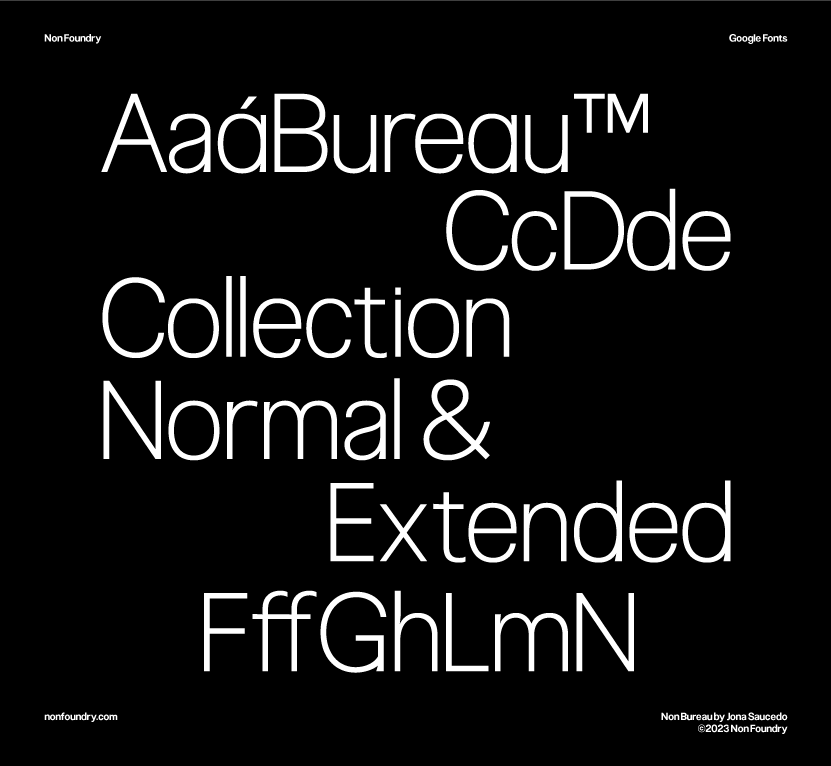

# My Font

[![][Fontbakery]](https://TheJonassss.github.io/non-bureau-collection/fontbakery/fontbakery-report.html)
[![][Universal]](https://TheJonassss.github.io/non-bureau-collection/fontbakery/fontbakery-report.html)
[![][GF Profile]](https://TheJonassss.github.io/non-bureau-collection/fontbakery/fontbakery-report.html)
[![][Outline Correctness]](https://TheJonassss.github.io/non-bureau-collection/fontbakery/fontbakery-report.html)
[![][Shaping]](https://TheJonassss.github.io/non-bureau-collection/fontbakery/fontbakery-report.html)

[Fontbakery]: https://img.shields.io/endpoint?url=https%3A%2F%2Fraw.githubusercontent.com%2FTheJonassss%2Fnon-bureau-collection%2Fgh-pages%2Fbadges%2Foverall.json
[GF Profile]: https://img.shields.io/endpoint?url=https%3A%2F%2Fraw.githubusercontent.com%2FTheJonassss%2Fnon-bureau-collection%2Fgh-pages%2Fbadges%2FGoogleFonts.json
[Outline Correctness]: https://img.shields.io/endpoint?url=https%3A%2F%2Fraw.githubusercontent.com%2FTheJonassss%2Fnon-bureau-collection%2Fgh-pages%2Fbadges%2FOutlineCorrectnessChecks.json
[Shaping]: https://img.shields.io/endpoint?url=https%3A%2F%2Fraw.githubusercontent.com%2FTheJonassss%2Fnon-bureau-collection%2Fgh-pages%2Fbadges%2FShapingChecks.json
[Universal]: https://img.shields.io/endpoint?url=https%3A%2F%2Fraw.githubusercontent.com%2FTheJonassss%2Fnon-bureau-collection%2Fgh-pages%2Fbadges%2FUniversal.json

Non Bureau is a sans serif typeface collection available in seven weights ranging from thin-black, each with an italic version. And a extended version, also available in seven weights and italic.

It has a wide linguistic support that includes extended Latin, Cyrillic and Greek.

The main objetive of Non Bureau was to offer a functional typeface collection capable of adapting to multiple environments and ensuring excellent readability in continuous text.

## About

Non Foundry is an independent foundry that offers custom fonts, retail fonts, research and consulting. Non's goal is to provide versatile fonts for a variety of uses, from functional to decorative. All our typefaces have print and web licenses and are available through our website.

## Building

Fonts are built automatically by GitHub Actions - take a look in the "Actions" tab for the latest build.

If you want to build fonts manually on your own computer:

* `make build` will produce font files.
* `make test` will run [FontBakery](https://github.com/googlefonts/fontbakery)'s quality assurance tests.
* `make proof` will generate HTML proof files.

The proof files and QA tests are also available automatically via GitHub Actions - look at https://TheJonassss.github.io/non-bureau-collection.

## Changelog

When you update your font (new version or new release), please report all notable changes here, with a date.
[Font Versioning](https://github.com/googlefonts/gf-docs/tree/main/Spec#font-versioning) is based on semver. 
Changelog example:

**26 May 2021. Version 2.13**
- MAJOR Font turned to a variable font.
- SIGNIFICANT New Stylistic sets added.

## License

This Font Software is licensed under the SIL Open Font License, Version 1.1.
This license is available with a FAQ at
https://scripts.sil.org/OFL

## Repository Layout

This font repository structure is inspired by [Unified Font Repository v0.3](https://github.com/unified-font-repository/Unified-Font-Repository), modified for the Google Fonts workflow.
